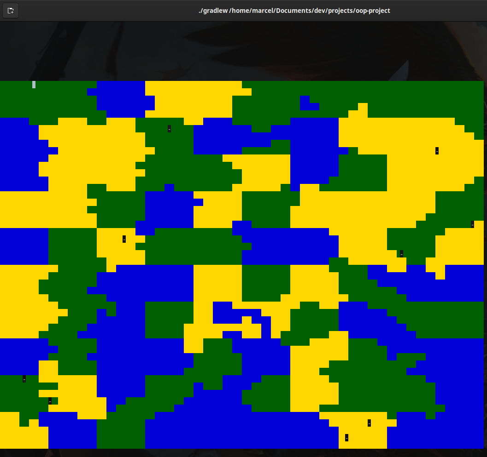

# oop-project

Projekt na kurs programowania obiektowego Politechniki Wrocławskiej.

## Wymagania

Aplikacja używa do rysowania [kodów ucieczki ANSI](https://en.wikipedia.org/wiki/ANSI_escape_code). Do poprawnego
działania aplikacji wymagany jest terminal wspierający te sekwencje.

### Linux/MacOS

Większość unixowych terminali wspiera kody ucieczki ANSI. Każdy emulator terminala oparty na xterm powinien działać. W
razie niepoprawnego rysowania, proszę utworzyć nowy issue.

### Windows

Można skorzystać z nowego
[Terminala Windows](https://www.microsoft.com/en-us/p/windows-terminal/9n0dx20hk701?activetab=pivot:overviewtab).

## Uruchamianie

```
$ git clone https://github.com/Bravo555/oop-project
$ cd oop-project
$ ./gradlew run
```


