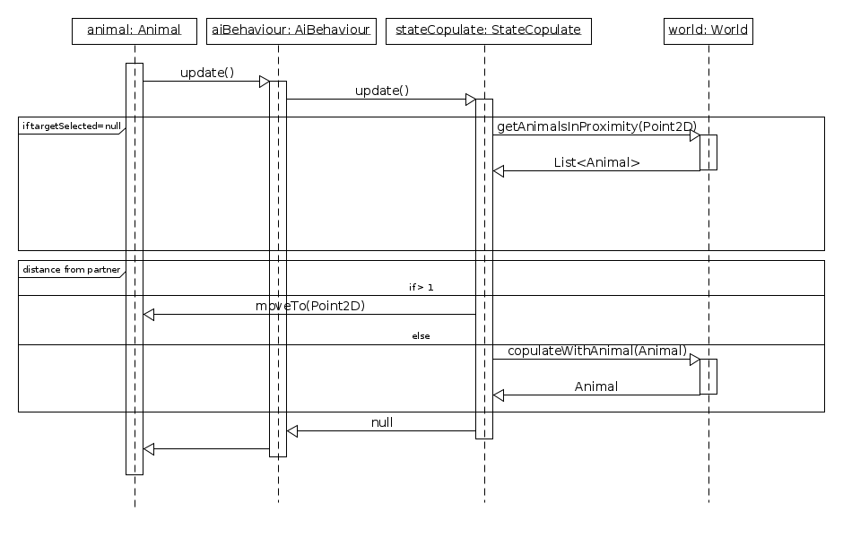
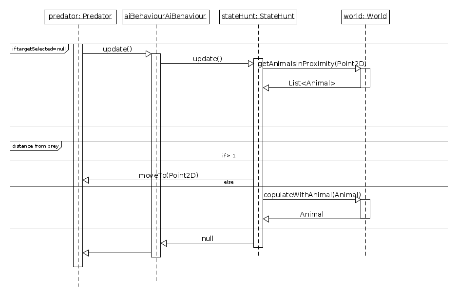
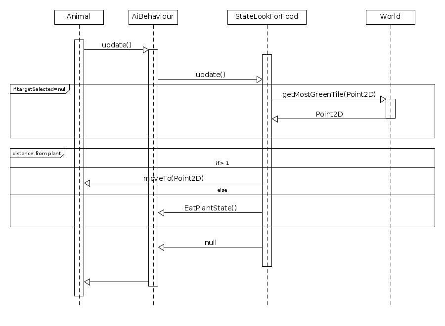
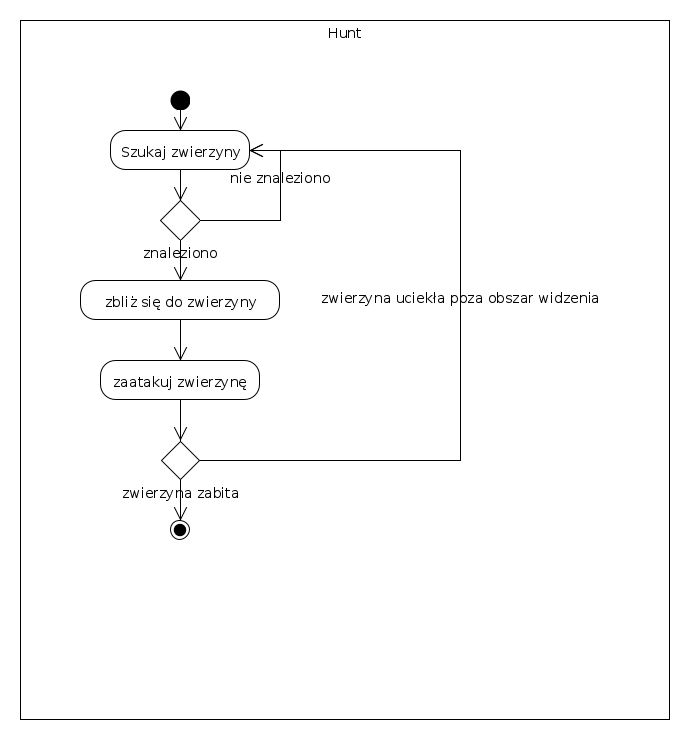
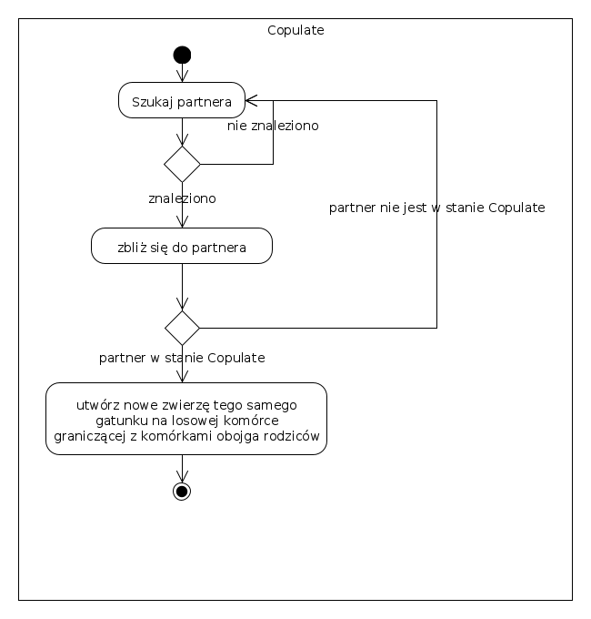
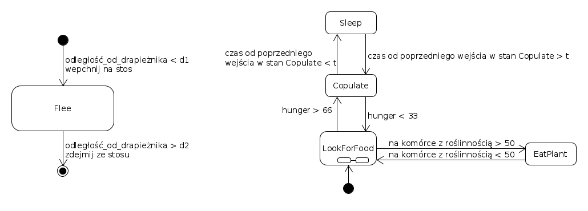
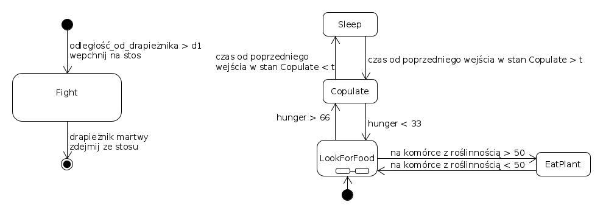
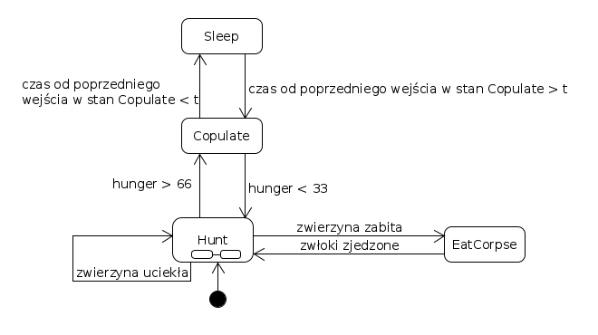
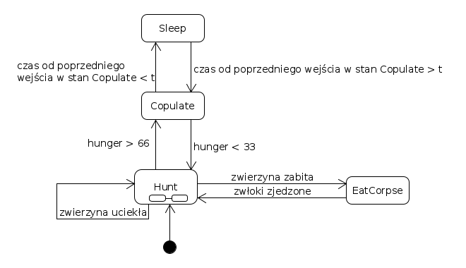
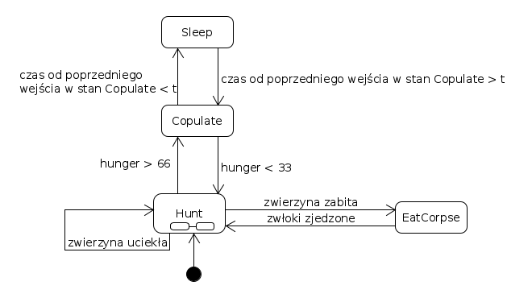

# Etap 4 - logika symulacji

## Diagramy sekwencji

- StateCopulate

- StateHunt

- StateLookForFood

Jak można zauważyć stany `Copulate` i `Hunt` mają bardzo podobną stukturę - obiekt stanu wysyła do `World` zapytanie o
listę innych zwierząt w pobliżu, którą filtrują wg. swoich predykatów. Tak podobną funkcjonalność można by wydzielić do
oddzielnej klasy.

## Diagramy aktywności

- Hunt

- Copulate

## Diagramy maszyny stanów

Zachowanie zwierząt będzie używało podejścia automatu ze stosem. Przykład: Podczas normalnego funkcjonowania (zwykła
maszyna stanów) pewne zwierzęta będą celem polowań innych zwierząt. W takim wypadku, gdy zwierzę zauważy lub usłyszy
drapieżnika znadjdującego się w odległości mniejszej niż pewna określona odległość graniczna, zwierzę powinno wejść w
stan ucieczki, a po jego zakończeniu (oddaleniu się od drapieżnika na odległość większą niż graniczna) powinno wrócić do
stanu poprzedniego. Zostanie do tego wykorzystany stos; wejście w stan ucieczki będzie wepchnięciem go na stos, a
wyjście z niego będzie wypchnięciem go ze stosu.

- Antelope

- Hippo

- Wolf

- Lion

- Crocodile

